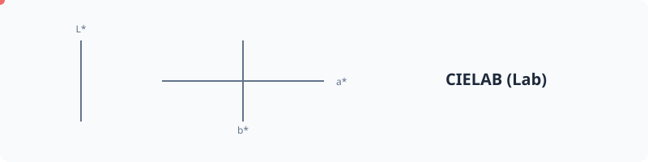

# Lab (CIELAB)



A device-independent color space designed to be perceptually uniform. Lab encompasses all colors visible to the human eye and serves as the foundation for modern color science and Delta E distance calculations.

## Usage

```php
use PhpColor\Color\LabColor;

// Create from components: L (0-100), a (-128 to 127), b (-128 to 127)
$color = new LabColor(53.0, 80.0, 67.0);

// Convert any color to Lab
$lab = $otherColor->to('lab');
```

## Advanced

### Perceptual Uniformity
Lab was the first major color space to achieve significant perceptual uniformity. 
- **L*** (Lightness): 0 (black) to 100 (white).
- **a***: Position between red/magenta and green (negative values are green, positive are red).
- **b***: Position between yellow and blue (negative values are blue, positive are yellow).

### Device Independence
Unlike sRGB or P3, which depend on the characteristics of a specific display, Lab describes colors exactly as the human eye sees them. This makes it the ideal "bridge" for converting between different hardware-dependent spaces.

## Examples

### Precise Lightness Measurement
Get the exact scientific lightness of any color, independent of its hue or saturation.

```php
$l = $color->to('lab')->l;
```

### Parsing CSS lab()
PHPColor fully supports the CSS Color Level 4 `lab()` functional notation.

```php
$color = Color::parse('lab(50% 40 20)');
```

## Navigation
- **Next**: [XYZ](xyz.md)
- **Previous**: [Adobe RGB](a98-rgb.md)
- **Home**: [Documentation Index](../../index.md)
