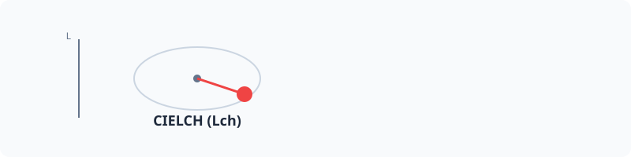

# Lch (CIELCH)



The cylindrical representation of the CIELAB color space. Lch defines colors by Lightness (0-100), Chroma (intensity), and Hue angle (0-360).

## Usage

```php
use PhpColor\Color\LchColor;

// Create from components: L (0-100), C (0-150+), H (0-360)
$color = new LchColor(53.0, 100.0, 40.0);

// Convert any color to Lch
$lch = $otherColor->to('lch');
```

## Advanced

### Lch vs Lab
Lch is mathematically identical to Lab, but uses polar coordinates (Chroma and Hue) instead of cartesian coordinates (a* and b*). This makes it much more intuitive for humans to work with, as "increasing chroma" or "rotating hue" are natural concepts.

### Oklch vs Lch
While Lch is more accurate than HSL, it is less perceptually uniform than **Oklch**. For most UI and design tasks, Oklch is recommended. Use CIELCH when you need to match specific scientific or industrial standards.

## Examples

### Adjusting Industrial Colors
Modify the intensity of a color without changing its base hue or brightness.

```php
$color = Color::parse('lch(50 40 20)');
$moreIntense = $color->withChannel('c', 60);
```

### Parsing CSS lch()
PHPColor fully supports the modern `lch()` functional notation.

```php
$color = Color::parse('lch(50% 40 20 / 0.5)');
```

## Navigation
- **Next**: [CMYK](cmyk.md)
- **Previous**: [XYZ](xyz.md)
- **Home**: [Documentation Index](../../index.md)
