# Oklab



Oklab is a perceptually uniform color space designed by Björn Ottosson in 2020. It is a significant improvement over CIELAB for color manipulation tasks.

## Why Oklab?

Traditional RGB spaces are not perceptually uniform. For example, changing the blue channel by 10% looks much more dramatic to our eyes than changing the green channel by 10%. 

Oklab solves this by providing a coordinate system where the distance between two colors corresponds to their perceived difference.

## Components

Oklab uses three coordinates:

-   **L (Lightness)**: Perceived brightness (0.0 to 1.0).
-   **a**: How green vs. red the color is.
-   **b**: How blue vs. yellow the color is.

## Usage

You can create Oklab colors directly or by converting from other spaces.

```php
use PhpColor\Color\Color;

// Create directly
$color = Color::oklab(0.6, 0.1, -0.1);

// Convert from sRGB
$blue = Color::parse('blue')->to('oklab');
```

## Benefits for UI

Oklab is highly recommended for:

1.  **Mixing colors**: Results in smooth transitions without "muddy" midpoints.
2.  **Generating shades/tints**: Maintains the perceived hue better than sRGB.
3.  **Contrast calculation**: Provides a more accurate basis for perceptual brightness.

---

Learn about the cylindrical version: [Oklch](./oklch.md)
