# Color Spaces




PHPColor provides comprehensive support for a wide variety of color spaces, ranging from standard web-safe spaces to modern perceptually uniform and wide-gamut spaces.

## Standard RGB

The foundation of web and digital display colors.

| Space | Description | Documentation |
| :--- | :--- | :--- |
| **sRGB** | The standard color space for the web and digital displays. | [Read more](./space/srgb.md) |

## Perceptual Spaces

Designed to mimic human color perception. These spaces are ideal for color manipulation, as changes in their components correspond directly to how we perceive those changes.

| Space | Description | Documentation |
| :--- | :--- | :--- |
| **Oklab** | A modern, perceptually uniform color space. | [Read more](./space/oklab.md) |
| **Oklch** | Cylindrical version of Oklab (Lightness, Chroma, Hue). Highly intuitive. | [Read more](./space/oklch.md) |
| **CIELAB** | Standard device-independent color space (Lab). | [Read more](./space/lab.md) |
| **CIELCH** | Cylindrical version of CIELAB (Lightness, Chroma, Hue). | [Read more](./space/lch.md) |

## Wide-Gamut RGB

Advanced spaces that can represent more vivid and saturated colors than standard sRGB.

| Space | Description | Documentation |
| :--- | :--- | :--- |
| **Display P3** | Used by modern Apple displays and high-end screens. | [Read more](./space/display-p3.md) |
| **Rec. 2020** | The standard for Ultra High Definition (UHD) television. | [Read more](./space/rec2020.md) |
| **Adobe RGB** | Developed for professional printing and photography (A98). | [Read more](./space/a98-rgb.md) |
| **ProPhoto** | An extremely wide-gamut space covering 90%+ of visible colors. | [Read more](./space/prophoto-rgb.md) |

These four constructors clamp each channel to `[0, 1]`:

```php
new DisplayP3Color(1.2, 0.0, 0.5);       // stored as 1.0, 0.0, 0.5
Color::parse('color(display-p3 1.2 0 0.5)')->toCss();
// color(display-p3 1 0 0.5)
```

CSS Color 4 allows coordinates outside `[0, 1]` in `color()`, and defers gamut mapping to the used value. A color parsed with out-of-range coordinates therefore does not round trip back to its original notation.

`SrgbColor` and `XyzColor` do not clamp, so out-of-sRGB intermediate values survive a conversion chain.

## Other Spaces

| Space | Description | Documentation |
| :--- | :--- | :--- |
| **CIE XYZ** | The device-independent "master" space (D65 illuminant). | [Read more](./space/xyz.md) |
| **CMYK** | Subtractive color model used for physical printing. | [Read more](./space/cmyk.md) |

## Conversions

You can convert any color to another space using the `to()` method.

```php
$color = Color::parse('#ff0000'); // sRGB

$oklch = $color->to('oklch');
$p3 = $color->to('display-p3');
```

---

Next: [Mixing](./mixing.md)
