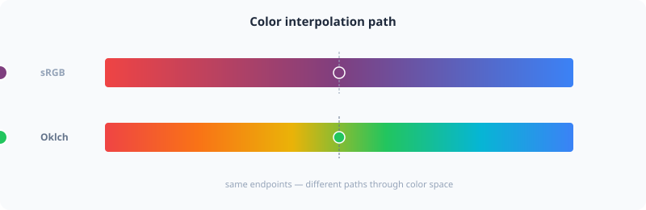

# Mixing


Smoothly interpolate between two colors using perceptual or standard color spaces.



## Usage

```php
use PhpColor\Color\Color;

// Mix two colors (50% each) in Oklab space (default)
$purple = Color::mix('red', 'blue', 0.5);

// Mix 20% of the second color into the first
$reddish = Color::mix('red', 'blue', 0.2);
```

## Advanced

### Mixing Spaces
The choice of color space dramatically affects the "midpoint" of a mix.

- **Oklab** (Default): Perceptually uniform. Prevents "muddy" or "gray" midpoints. Recommended for most UI tasks.
- **sRGB**: Standard linear interpolation. Useful when matching legacy CSS behavior or simple RGB animations.

```php
// Force mixing in linear sRGB
$result = Color::mix($c1, $c2, 0.5, 'srgb');
```

### CSS color-mix()
PHPColor fully supports the modern CSS `color-mix()` functional notation, allowing for complex late-resolved mixing.

Learn more about CSS expressions in the [CSS Colors](../reference/css-colors.md) documentation.

```php
use PhpColor\Color\Css\CssColor;

$expr = CssColor::parse('color-mix(in oklab, red 30%, blue)');
```

## Examples

### Generating a Hover State
Create a consistent "active" state by mixing any color with a small amount of white or black.

```php
$hoverColor = Color::mix($brandColor, 'white', 0.15);
```

### Visualizing Data Scales
Generate intermediate steps between two threshold colors.

```php
$steps = [];
for ($i = 0; $i <= 1.0; $i += 0.25) {
    $steps[] = Color::mix($start, $end, $i);
}
```

## Navigation
- **Next**: [Gradient](gradient.md)
- **Previous**: [Temperature](temperature.md)
- **Home**: [Documentation Index](../index.md)
