# Relative Colors



PHPColor fully supports the modern CSS **Relative Color Syntax** (RCS), allowing you to derive new colors from an existing one by manipulating its channels.

## Basic Syntax

The relative syntax uses the `from` keyword within a color function. You provide an origin color and then specify how to transform its channels.

```php
// Increase the lightness of a base color by 20%
$lighter = Color::parse('oklch(from #336699 calc(l + 0.2) c h)');

// Force a color to a specific hue while keeping its vibrancy
$themed = Color::parse('oklch(from var(--brand) l c 150)');
```

## Channel Manipulation

When using `from`, the individual channels of the origin color are available as variables within the function.

### Standard Channels

The available variables depend on the function used:

| Function | Variables |
| :--- | :--- |
| `rgb()` / `rgba()` | `r`, `g`, `b`, `alpha` |
| `hsl()` / `hsla()` | `h`, `s`, `l`, `alpha` |
| `oklch()` | `l`, `c`, `h`, `alpha` |
| `oklab()` / `lab()` | `l`, `a`, `b`, `alpha` |

### Using `calc()`

You can use complex math expressions to calculate new channel values.

```php
// Double the chroma of a color
$vivid = Color::parse('oklch(from blue l calc(c * 2) h)');

// Set alpha to 50% of its original value
$faded = Color::parse('rgb(from red r g b calc(alpha / 2))');
```

## Changing Color Spaces

One of the most powerful features of RCS is the ability to change the color space of the origin color during transformation.

```php
// Convert an sRGB hex to OKLCH and rotate the hue
$rotated = Color::parse('oklch(from #ff0000 l c calc(h + 90))');
```

## Programmatic Usage

You can also create relative color expressions programmatically using the `CssColor` factory.

```php
use PhpColor\Color\Css\CssColor;

$expr = CssColor::from(
    targetSpace: 'oklch',
    origin: '#336699',
    channels: [
        'l' => 'calc(l + 0.1)',
        'c' => 'c',
        'h' => 'h'
    ]
);

$color = $expr->resolve(new CssContext());
```

---

Back to [CSS Colors](./colors.md) overview.
