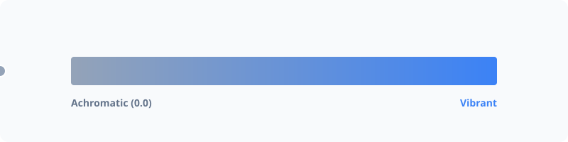

# Chroma



Control the intensity and colorfulness of colors. PHPColor uses Oklch chroma for perceptually accurate saturation adjustments.

## Usage

```php
use PhpColor\Color\Color;

$color = Color::parse('#3b82f6');

// Get chroma value (typically 0.0 to 0.4+)
$c = $color->getSaturation(); 

// Increase chroma (saturate)
$vivid = $color->saturate(0.1);

// Decrease chroma (desaturate)
$muted = $color->desaturate(0.1);

// Convert to absolute grayscale (chroma = 0)
$gray = $color->grayscale();
```

## Advanced

### Oklch Chroma vs HSL Saturation
Traditional HSL saturation is a mathematical convenience that doesn't account for how our eyes see color. Oklch chroma measures "perceived colorfulness"—a chroma of 0.1 in Oklch will appear equally colorful regardless of the hue or lightness.

### Grayscale Preservation
`grayscale()` removes all chroma while preserving the exact perceived lightness (L) of the color. This is more accurate than simple RGB averaging.

## Examples

### Creating Muted Variants
Create a subtle version of a brand color for secondary UI elements.

```php
$mutedBg = $brandColor->withAlpha(0.1)->desaturate(0.2);
```

### Checking for Achromatic Colors
Determine if a color is effectively gray (no significant hue).

```php
if ($color->getSaturation() < 0.01) {
    echo "Color is achromatic";
}
```

## Navigation
- **Next**: [Temperature](temperature.md)
- **Previous**: [Hue](hue.md)
- **Home**: [Documentation Index](../index.md)
