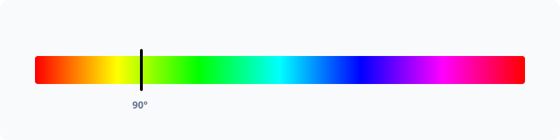

# Hue



Work with color hue in degrees [0, 360). PHPColor uses perceptually uniform Oklch for hue operations.

## Usage

```php
use PhpColor\Color\Color;

$color = Color::parse('hsl(120 50% 50%)');

// Get hue in degrees (0-360)
$h = $color->getHue(); // 120.0

// Rotate hue by 90 degrees
$newColor = $color->rotateHue(90);
```

## Advanced

### Perceptual Uniformity
Traditional HSL/HSV hue rotation often changes the perceived brightness or saturation of a color. PHPColor performs rotations in **Oklch** space, which ensures that lightness and chroma remain constant while only the hue changes.

### Units
While the API uses degrees, the CSS parser supports all standard units:
```php
Color::parse('oklch(0.5 0.1 0.5turn)');
Color::parse('oklch(0.5 0.1 1.5rad)');
Color::parse('oklch(0.5 0.1 200grad)');
```

## Examples

### Generating Hue Variants
Create a series of colors by rotating the hue around the color wheel.

```php
$variants = [];
for ($i = 0; $i < 360; $i += 30) {
    $variants[] = $baseColor->rotateHue($i);
}
```

### Harmonizing Different Colors
Force multiple colors to have the same hue while keeping their original lightness.

```php
$hue = $brandColor->getHue();
$harmonized = $otherColor->withChannel('h', $hue);
```

## Navigation
- **Next**: [Chroma](chroma.md)
- **Previous**: [CMYK](space/cmyk.md)
- **Home**: [Documentation Index](../index.md)
