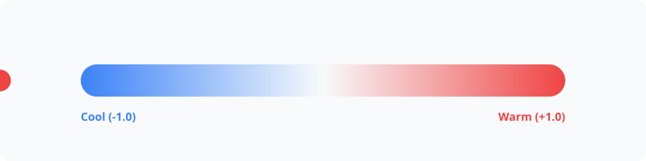

# Temperature



Analyze and manipulate the perceptual temperature of colors, from cool blues to warm reds.

## Usage

```php
use PhpColor\Color\Color;

$color = Color::parse('#ef4444');

// Get temperature value from -1.0 (cool) to +1.0 (warm)
$temp = $color->temperature(); // ~0.95

// Predicates
$isWarm = $color->isHot();
$isCool = $color->isCold();
```

## Advanced

### Perceptual Shifting
Adjust the temperature of a color by shifting its hue toward orange (warm) or cyan (cool) in Oklch space.

```php
// Make 20% warmer
$warmer = $color->warm(0.2);

// Make 50% cooler
$cooler = $color->cool(0.5);
```

### Neutral Colors
Colors near the center of the scale (around 0.0) are considered neutral. In Oklch, these typically fall in the green or magenta regions where the temperature transitions.

## Examples

### Filtering Warm Colors
Create a subset of a palette containing only warm tones.

```php
$warmPalette = $palette->filter(fn($c) => $c->isHot());
```

### Auto-Cooling for Dark Mode
Subtly cool down vibrant brand colors when generating dark mode variants.

```php
$darkModeBrand = $brandColor->darken(0.4)->cool(0.1);
```

## Navigation
- **Next**: [Mixing](mixing.md)
- **Previous**: [Chroma](chroma.md)
- **Home**: [Documentation Index](../index.md)
