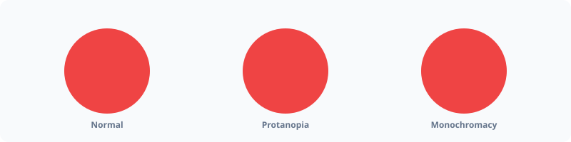

# Vision



Simulate how colors appear to people with different types of color vision deficiency (color blindness).

## Usage

```php
use PhpColor\Color\Vision\ColorVisionSimulator;
use PhpColor\Color\Vision\VisionProfile;

$simulator = new ColorVisionSimulator();

// Simulate Deuteranopia (green-absent)
$green = Color::green();
$simulated = $simulator->simulate($green, VisionProfile::Deuteranopia);

echo $simulated->toHex(); // #8b7800
```

## Advanced

### Supported Profiles
PHPColor supports simulation for all common vision deficiencies:

- **Protanopia / Protanomaly**: Red-blind / Red-weak
- **Deuteranopia / Deuteranomaly**: Green-blind / Green-weak
- **Tritanopia / Tritanomaly**: Blue-blind / Blue-weak
- **Monochromacy**: Total color blindness (grayscale)

### Accessibility Testing
The simulator provides a convenience method to check if two colors remain distinguishable under a specific vision profile.

```php
$isSafe = $simulator->areDistinguishable($c1, $c2, VisionProfile::Protanopia);
```

## Examples

### Batch Simulating a Palette
See how your entire design system looks to a color-blind user.

```php
$simulatedPalette = $simulator->simulateAll($palette->all(), VisionProfile::Deuteranopia);
```

### Automatic Accessibility Audit
Validate that critical UI elements (like primary vs. secondary buttons) are distinguishable for all users.

```php
foreach (VisionProfile::commonlyTested() as $profile) {
    if (!$simulator->areDistinguishable($primary, $bg, $profile)) {
        echo "Accessibility warning for profile: {$profile->value}";
    }
}
```

## Navigation
- **Next**: [sRGB](space/srgb.md)
- **Previous**: [Distance](distance.md)
- **Home**: [Documentation Index](../index.md)
